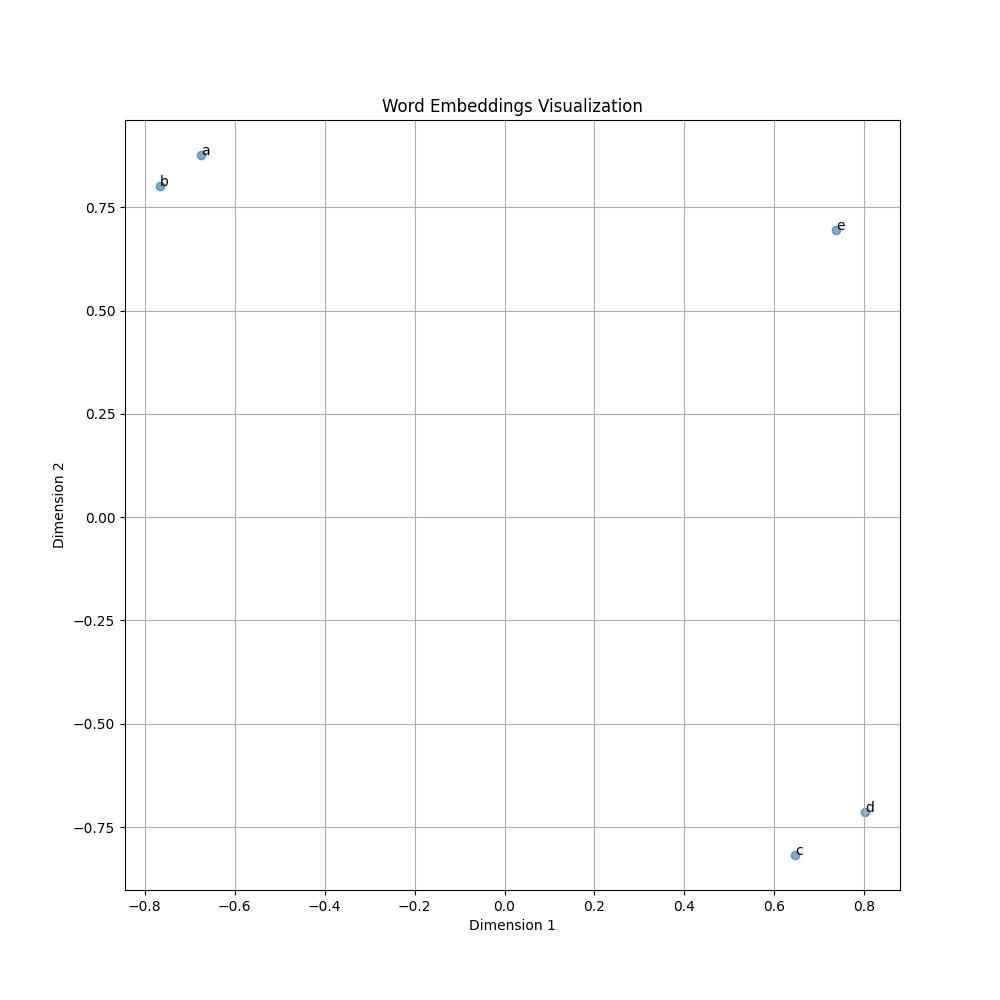

# Deep learning graph shallow encoders - DeepWalk and node2vec

## Description

This repository provides from-the-ground-up implementations of both [DeepWalk](https://arxiv.org/abs/1403.6652) 
and [node2vec](https://arxiv.org/abs/1607.00653). It also encompasses a handcrafted version of
[word2vec](http://arxiv.org/abs/1301.3781) 
with [negative sampling](http://arxiv.org/abs/1310.4546), 
fundamental to the workings of DeepWalk and node2vec.

## Table of Contents

- [Introduction](#introduction)
- [Experiments](#experiments)
  * [Word2vec](#word2vec-1)
  * [DeepWalk and Node2vec](#deepwalk-and-node2vec)
- [Usage](#usage)
- [References](#references)

## Introduction

This section briefly explains word2vec, DeepWalk and node2vec.

### Word2vec

Word2Vec is a technique to represent words as continuous vector spaces. 
The primary intuition is that words appearing in similar contexts in a sentence 
tend to have similar meanings. This task can be approached in two ways:
- Based on the observed word, predict context words - SkipGram.
- Based on the observed context, predict missing word - CBOW (Continuous Bag Of Words).

Consider sentence "Cats are similar to dogs in many ways.". Goal for SkipGram would
be to predict context words "Cats", "are", "similar", "to", "in", "many", "ways" based
on the observed word "dogs". For CBOW it would be opposite.


Each word is encoded using [one-hot](https://en.wikipedia.org/wiki/One-hot) encoding to
obtain its one-hot vector. Afterward, each vector is projected to the embedding space
using a projection matrix. This operation can be performed more efficiently through a word index lookup
(check: [Pytorch Embedding](https://pytorch.org/docs/stable/generated/torch.nn.Embedding.html)).

For the SkipGram model, it is trained to predict if another word 
(represented as an embedding) occurs in the context (refer to the image above on the right). 
For CBOW, the process is similar, expect
instead of using embedding vector of a single observed word, a context representation vector
is obtained by averaging over all context embedding vectors (refer to the image above on the left).

The cross-entropy function is utilized for model training. Using it directly results in an intractable computation. 
Instead, hierarchical softmax ([original word2vec paper](https://arxiv.org/abs/1301.3781)) 
or negative sampling ([follow-up paper](https://proceedings.neurips.cc/paper_files/paper/2013/file/9aa42b31882ec039965f3c4923ce901b-Paper.pdf)) 
is employed. In short, cross-entropy compute time depends on the vocabulary size
which can be huge (e.g. 1 million tokens). Executing that many operations per word
is computationally unfeasible. Hierarchical softmax and negative samplings are remedy for this.
In this implementation, negative sampling is the chosen method.

We use separate embedding weights for input and context words. 
Although it's theoretically acceptable to use the same weights for both input and context words, 
the model becomes more expressive when two different embedding matrices are used.

### DeepWalk

We possess a tool to learn word embeddings from a given corpus. In case of graphs we
can generate "sentences" using graph [random walks](https://en.wikipedia.org/wiki/Random_walk).
Basically, we start from a particular node and traverse through graph by choosing random neighbor
for *N-1* steps where *N* is random walk length. For every node we can generate multiple
random walks. Once we obtain enough random walks we can form a "node corpus" and use
word2vec to train learn node embeddings. Three hyperparameters can be observed here:
- Number of random walks per node for each epoch.
- Random walk length.
- Context radius (length) for each node.

Note that in this implementation we generate new random walks for each epoch.

### Node2vec

Node2vec is extension of the DeepWalk algorithm. It presents three main contributions compared to the
original paper:
- It uses [negative sampling](http://arxiv.org/abs/1310.4546) instead of 
  [hierarchical softmax](https://arxiv.org/abs/1301.3781)
  that was also used in the original word2vec paper 
  (follow-up paper used negative sampling instead).
- It introduces more flexible algorithm for random walk generation.
- It defines a way to obtain edge embeddings from node embeddings. Edge embeddings
  can be used for link prediction task - predicting if an edge exists between two nodes.

#### Random walk generation

Assume that *v* is current node in the random walk generation algorithm and
we have to choose next node that will be added to the walk. Node *t* is the previous
node in the walk, and *x* is the candidate node (potential next node).
Weights for each node are modified following rules:
- by `1/p` if `shortest_path(t, x) == 0` (i.e. x == t)
- by `1` if `shortest_path(t, x) == 1` 
- by `1/q` if `shortest_path(t, x) == 2`

where *p* (return parameter) and *q* (in-out parameter) are random walk generation hyperparameters:
- Higher values for *p* lowers chance of adding already explored node to the random walk.
- Lower values for *p* increases chance of going back and keeps the walk "local".
- Higher values for *q* bias walks to move more towards node *t* ("inwards", BFS-like).
- Lower values for *q* bias walks to move from node *t* ("outwards", DFS-like).


#### Edge embeddings

Edge embedding can be obtained from the node embeddings. We just need to define 
a function *f* (heuristic) that aggregates arbitrary nodes *n1* and *n2*: 
`vector(edge(n1, n2)) = f(vector(n1), vector(n2))`. Examples:
- Average: `f(vector(n1), vector(n2)) = (vector(n1) + vector(n2)) / 2`;
- Hadamard (point-wise multiplication): `f(vector(n1), vector(n2)) = vector(n1) * vector(n2)`
- point-wise L1 distance: `f(vector(n1), vector(n2)) = |vector(n1) - vector(n2))|`
- point-wise L2 distance: `f(vector(n1), vector(n2)) = (vector(n1) - vector(n2)))^2`

## Experiments

### Word2vec

Both Skip-Gram and CBOW implementation are supported.

Supported text-based datasets are:
- ABCDE (custom test dataset)
- Shakespeare
- WikiText-2
- WikiText-103

#### Toy example - ABCDE

This dataset is used as an sanity test - 
checks is custom implementation of the word2vec model works:
- `a b a b a b a b a b`,  `a` goes with `b`
- `a b a b a b`,
- `b a b a`,
- `a b a b a b a b`,
- `c d c d c d c d`,  `c` goes with `d`
- `d c d c d c`,
- `c d c d c d`,
- `e e e e e e e e`,  `e` goes alone
- `e e e`

The expected model should position the embeddings of words "a" and "b" close together, 
as well as "c" and "d". However, the word "e" should form its own isolated cluster. 
On the other hand, even though vectors "a" and "b" are close, 
they shouldn't "match" because they don't share the same tokens in their context. Results:



For this experiment embedding dimension 2 was used. Full experiment configuration
can be found here `configs/w2v_sg_abcde.yaml` and `configs/w2v_cbow_abcde.yaml`.

#### Shakespeare dataset

Please note that minimal effort was invested in preprocessing the input sentences 
for the Word2Vec case. These datasets were primarily analyzed to 
validate the Word2Vec implementation. Enhancing data preparation could potentially 
lead to significant improvements in the results. Additionally, in the original paper, 
aggressive subsampling was used for very frequent words. This detail was omitted in this 
implementation since our primary focus is on learning graph embeddings rather than word 
embeddings.

For this experiment embedding dimension 12 was used. Full experiment configuration
can be found here `configs/w2v_shakespeare.yaml`.

##### Closest word pairs

Finding the closest context words for the chosen input word is performed using 
[cosine similarity](https://en.wikipedia.org/wiki/Cosine_similarity)
between embedding vectors of the trained model. 
Some examples (*input word*: *closest context words*):
- king: king, young, duke
- queen: young, queen, king
- duke: duke, king, enter
- lord: young, king, lord
- lady: hear, lady, boy
- kiss: about, leave, hand

##### Embedding visualization

Input word embeddings visualization. 


Only the most frequent words are selected, and this includes stopwords, which are typically not of primary interest. 
Still we can observe two interesting clusters:
- Royalty cluster (red) - king, queen, prince, lord, etc.
- Relationship cluster (blue) - son, friend, brother, wife, etc.

##### Semantic tests

Here we perform simple semantic calculations and check if the "model" can answer properly.
For an example, it is ideal if vector `vector("king") - vector("man") + vector("woman")`
is close to vector `vector("queen")`. Results:
- Similarity between vector("king") - vector("man") + vector("woman") and vector("queen") is 0.59 (good)
- Similarity between vector("queen") - vector("woman") + vector("man") and vector("king") is 0.43 (good)
- Similarity between vector("king") - vector("queen") + vector("woman") and vector("man") is -0.05 (bad)
- Similarity between vector("queen") - vector("king") + vector("man") and vector("woman") is 0.23 (bad)

### DeepWalk and node2vec

DeepWalk and Node2Vec are implemented as extensions of the Word2Vec model.

Supported datasets are:
- Graph triplets (test dataset)
- Zachary's Karate club
- Cora

#### Toy example - Graph Triplets

This graph consists of 3 fully connected components consisting of three nodes. Model
should be able to learn to cluster these nodes together in embeddings space. 

For this experiment embedding dimension 2 was used. Full experiment configuration
can be found here `configs/sge_sg_graph_triplets.yaml`. 

##### Embedding visualization


We can observe that clusters are successfully formed. One can tune the training parameters to 
either increase or decrease the separation between these clusters, 
and to make the nodes within each cluster more or less merged. If we query 
for the two closest context nodes for each input node, we always get two nodes 
from the same input node cluster, which is what we expect.

##### Downstream tasks

In order to additionally evaluate quality of these embeddings, two downstream tasks
are performed:
- Node classification: [A scikit-learn logistic regression model](https://scikit-learn.org/stable/modules/generated/sklearn.linear_model.LogisticRegression.html) 
  is trained to predict node's label based on its vector embedding. 
  If there are multiple classes then
  [one-vs-rest](https://scikit-learn.org/stable/modules/generated/sklearn.multiclass.OneVsRestClassifier.html)
  approach is used. It is required that the dataset has label nodes.
- Edge classification (link prediction more precisely): similar to *node classification*, a model
  is trained to predict if edge exists between two nodes. More precisely, model
  predicts if edge exists based on the edge embedding. This embedding is obtained using a
  function *f* that aggregates arbitrary nodes *n1* and *n2*:
  `vector(edge(n1, n2)) = f(vector(n1), vector(n2))`.

The model is evaluated using [transduction](https://en.wikipedia.org/wiki/Transduction_(machine_learning). 
This means that during unsupervised learning - while training the shallow graph encoder 
(either DeepWalk or node2vec) — 
the complete graph structure is known. For downstream tasks, we partition the data for 
both training and evaluation of the node label classifier. 
Experiments are conducted multiple times to obtain an average metric result.

Results:
- Node classification accuracy (averaged over 10 experiments): 88.89% (best: 100.00%)
- Edge classification accuracy (averaged over 10 experiments): 85.83% (best: 100.00%)

Visualization of best node classification model:


#### Zachary's karate club


Another small dataset that can be used for model analysis is [Zachary's karate club](https://en.wikipedia.org/wiki/Zachary%27s_karate_club).
This graph has weighted edges and random walks are sampled based on that. Probability
of picking successor node based on the current node is proportional to edge weight. It 
is assumed that all weights are positive. 

For this experiment embedding dimension 2 was used. Full experiment configuration
can be found here `configs/sge_sg_karate_club.yaml`.

##### Embeddings visualization


We can observe that two groups of nodes are clustered almost perfectly. Only
node *n09* is outside the green (label 1) cluster but these groups can still be easily
separated using a line. In case dataset edge weights are not used
then these cannot be separated as distinctly.

##### Downstream tasks

Similar configuration as for graph triplets is used for the downstream tasks.

Results:
- Node classification accuracy (averaged over 10 experiments): 98.06% (best: 100.00%)
- Edge classification accuracy (averaged over 10 experiments): 69.52% (best: 80.13%)

Visualization of best node classification model:


#### Cora dataset


The Cora dataset consists of 2708 scientific publications classified into one of seven classes:
- `Case_Based`
- `Genetic_Algorithms`
- `Neural_Networks`
- `Probabilistic_Methods`
- `Reinforcement_Learning`
- `Rule_Learning`
- `Theory`
Each node represents one scientific publication. Each edge represents citation.
The citation network consists of 5429 links. This is one of the standard dataset
for evaluating graph based machine learning algorithm.

For this experiment embedding dimension 8 was used. For 2D visualization we 
use [T-SNE](https://en.wikipedia.org/wiki/T-distributed_stochastic_neighbor_embedding).
Full experiment configuration can be found here `configs/sge_sg_cora.yaml`. 

##### Embedding visualization


From the visualized embedding, we can observe that all subjects
form clusters that overlap with few others. There is also a large cluster 
comprised of mixed node labels. The model was not able to successfully separate these nodes, 
leading us to expect weaker results when using logistic regression for classification.

##### Downstream tasks

Similar configuration as for graph triplets is used for the downstream tasks. The main
difference is that for this task we also combine node features with embeddings as an input
vector that is used for the prediction task. Each node has 1433 flags that
represent word occurrences in the publication.

Results:
- Node classification accuracy (averaged over 10 experiments): 68.55% (best: 70.90%)
- Edge classification accuracy (averaged over 10 experiments): 81.65% (best: 82.02%)

Link prediction has decent accuracy while node classification has somewhat
weaker accuracy. Playing with node2vec and logistic regression hyperparameters can improve
the accuracy.

## Usage

This section explains installation and framework usage.

### Installation

Create a virtual environment and run:
```
pip3 install -r requirements.txt
```

### Training a model

In order to train a model use next command:
```
python3 tools/train.py --config-name=<config_name>
```

Start Tensorboard:
```
tensorboard --port <port> --host 0.0.0.0 --logdir runs/tb_logs --load_fast=false
```

Start Tensorboard in background:
```
nohup tensorboard --port <port> --host 0.0.0.0 --logdir runs/tb_logs --load_fast=false &
```

Open Tensorboard on `http://localhost:<port>`

### Model analysis

Model analysis supports graph and text datasets. Model analysis performs:
- closest pairs analysis
- Visualize embeddings (performs T-SNE in case embeddings are not 2D)
- Semantics test (not supported for graphs)

```
python3 tools/model_analysis.py --config-name=<config_name>
```

### Downloading dataset

Dataset download is implemented for "wiki-text-2", "wiki-text-103", "cora" and "ppi" datasets. Command:
```
./download_dataset.sh <name>
```

### Graph downstream tasks

Performs downstream tasks (node classification and edge prediction) based
on the learned node embeddings and/or node features.

```
python3 tools/graph_model_downstream_classification.py --config-name=<config_name>
```

## References

Key papers
- [Efficient Estimation of Word Representations in Vector Space](http://arxiv.org/abs/1301.3781)
- [Distributed Representations of Words and Phrases and their Compositionality](http://arxiv.org/abs/1310.4546)
- [Noise-Contrastive Estimation of Unnormalized Statistical Models, with Applications to Natural Image Statistics](https://www.jmlr.org/papers/volume13/gutmann12a/gutmann12a.pdf)
- [DeepWalk: Online Learning of Social Representations](http://arxiv.org/abs/1403.6652)
- [node2vec: Scalable Feature Learning for Networks](http://arxiv.org/abs/1607.00653)

Books:
- [Graph Representation Learning](https://www.cs.mcgill.ca/~wlh/grl_book/files/GRL_Book.pdf)

Videos:
- [Stanford CS224W](https://www.youtube.com/watch?v=JAB_plj2rbA&list=PLoROMvodv4rPLKxIpqhjhPgdQy7imNkDn)
